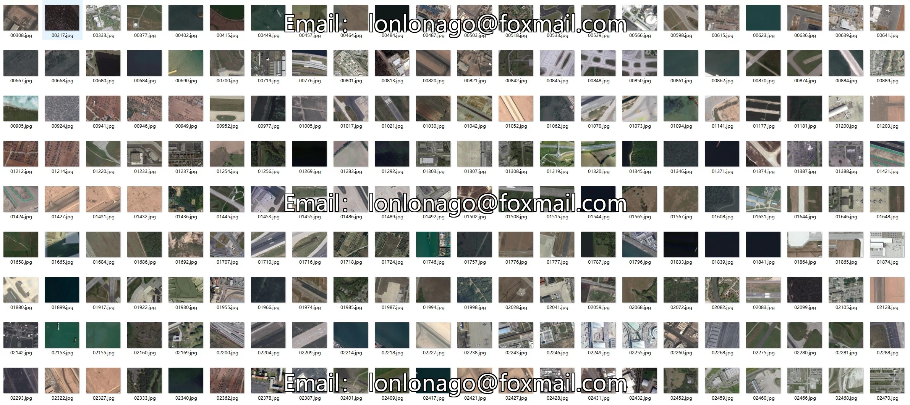
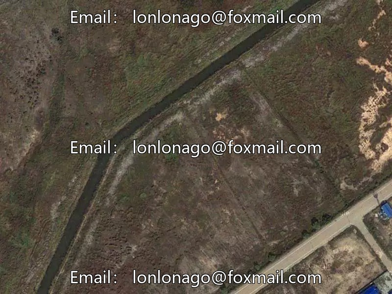
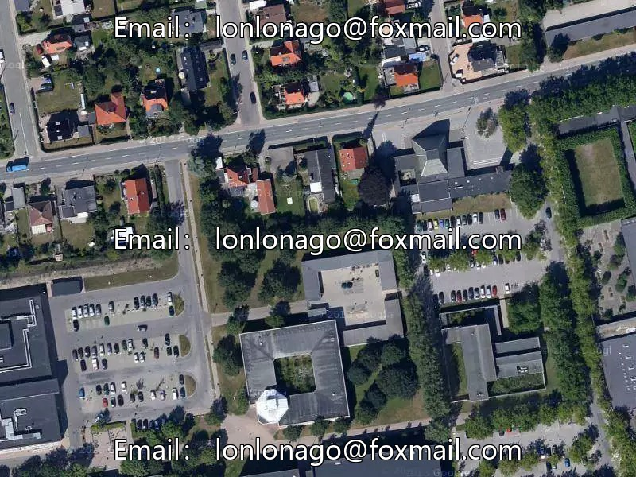
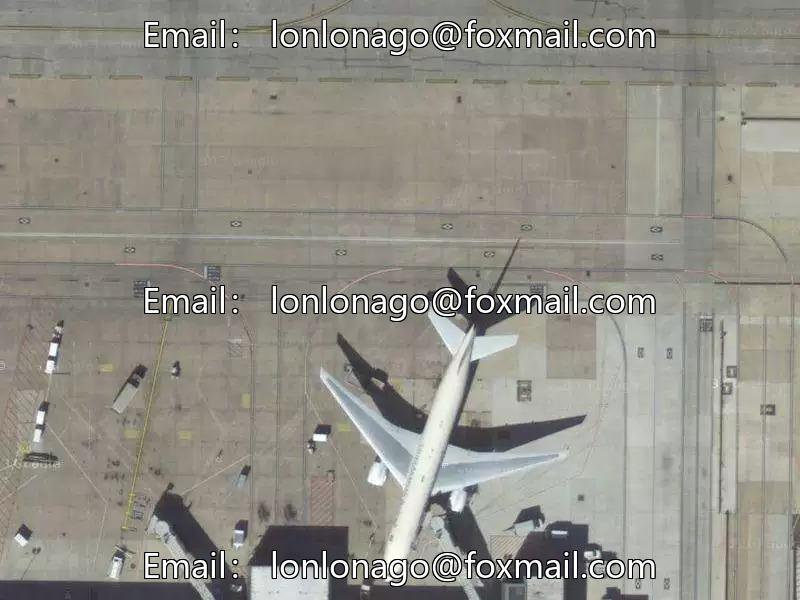
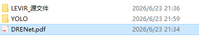

## Body

LEVIR dataset is a tiny object detection dataset in YOLO format.

The LEVIR dataset consists of 21,952 images with a single image size of 800×600 JPG and has been converted to YOLO format for direct training.
----Resolution: 0.2m～1m / pixel
----Source: Google

Total number of labeled instances:
----A total of 11,028 labeled boxes, divided into three categories:
----Airplanes: 4,724
----Tanker: 3,025
----Storage tank: 3,279

The training set, test set, validation set, and the ratio of 7:2:1 have been well-defined.

This product is sold as an electronic virtual product and does not accept returns or exchanges.

## Images

item_1062271428728

Here is a pay link on Stripe ( https://buy.stripe.com/3cs8yP7sY87d0vu9AB ). Please contact me lonlonago@foxmail.com after funding $89, and I will send you a complete data files , thank you!

